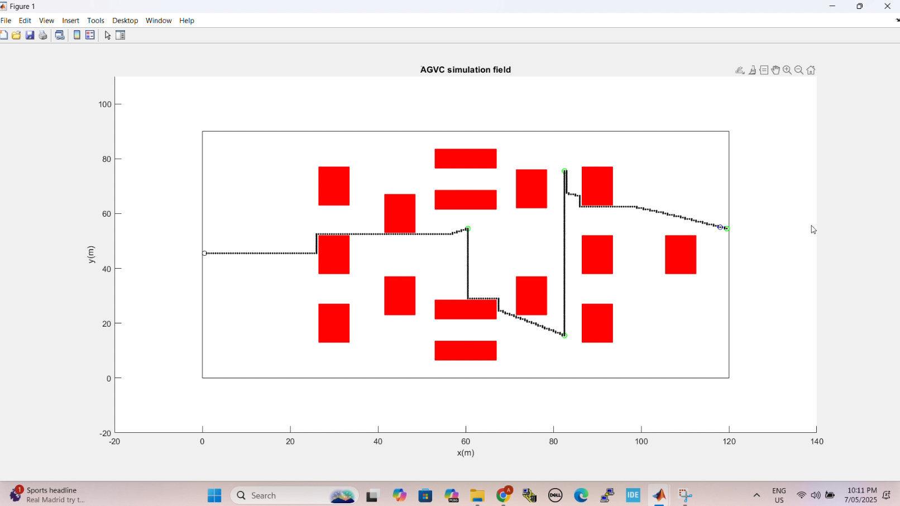

# AGVC-Path-Planning-Simulation
MATLAB simulation of A* path planning for autonomous ground vehicle (AGVC)
This MATLAB project simulates autonomous navigation in a soccer field environment using the A* algorithm. The robot must visit four predefined targets while avoiding static rectangular obstacles. This work was completed as part of the **SEN771 - Artificial Intelligence for Autonomous Control** unit at Deakin University.

## 🧠 What I Learned

- Implemented a **custom A* pathfinding algorithm** on a grid-based environment.
- Simulated a **1m-diameter mobile robot** navigating within a 120m x 90m field.
- Dynamically generated and visualized **obstacle fields** with random widths.
- Developed a strategy to visit **multiple targets in an optimal sequence**.
- Programmed **backtracking** behavior to return to the starting position.
- Strengthened skills in **MATLAB programming**, simulation, and visual debugging.

## 🚀 Features

- Obstacle detection and avoidance
- Target sequence optimization
- Real-time simulation with visual output
- Autonomous return to start point
- Dynamic mesh and grid creation

## 📷 Simulation Snapshot
*(Optional: Add an image of your MATLAB plot here in 
\

## 📂 File Structure

- `AGVC_Simulation.m`: Main MATLAB simulation script
- `README.md`: Project overview and learning outcomes

## 🛠️ Technologies Used

- MATLAB R2021a
- A* Algorithm
- 2D plotting and grid visualization

## 👨‍🎓 Author

**Abdul Razzak Mohamed Rasmy**  
Bachelor of Mechatronics Engineering | Deakin University

## 🔗 LinkedIn

Feel free to connect with me on [LinkedIn](https://www.linkedin.com/in/abdurrazzak0126?lipi=urn%3Ali%3Apage%3Ad_flagship3_profile_view_base_contact_details%3BMjXIjHgPQa%2BAlavrWKUqIg%3D%3D) and explore more of my work!

---

## 📝 Notes

This simulation is based on a scenario from the 2013 Autonomous Ground Vehicle Competition (AGVC), adapted for academic purposes.
